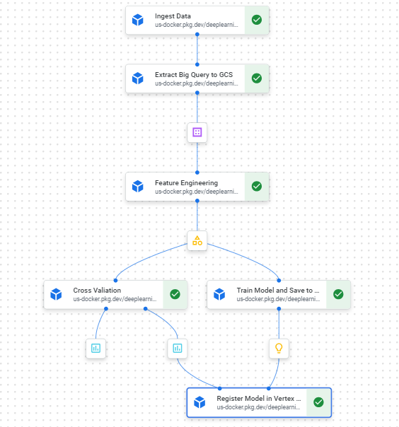

# oxheart-prototype

This repository defines a kubeflow pipeline for an inital prototype of a heart disease prediction model and deploys it on Vertex AI pipelines. The pipeine should compile as below:



Required IAM permissions for GCP service account:

* `Vertex AI Service Agent`

To clone the repository:
```bash
git clone https://github.com/pbevan1/oxheart-prototype.git
```

To install the required packages to compile the pipeline:
```bash
pip install -r requirements.txt
```

To manualy run tests do:
```bash
pyest
```

To compile the training pipeline and deploy on Vertex AI pipelines:
```bash
python kubeflow_train_pipeline.py
```

The evaluation results for each pipeline run can be checked in the Vertex AI Piplines UI.

To deploy the newest model to GCP cloud run API
```bash
gcloud run deploy mf-oxheart-test --source=. --region=europe-west1 --set-env-vars=API_KEY="API_KEY" --allow-unauthenticated --platform=managed
```

To query the API to get predictions on new data (example data):

```bash
cd deploy_model
curl -X POST "https://mf-oxheart-prototype-r72sq3y5oa-ew.a.run.app/predict/" -H "X-API-KEY: API_KEY" -H "Content-Type: application/json" -d '{"features": "59,1,0,110,239,0,0,142,1,1,1,3"}'
```

**NOTE**: The model isn't trained using `oldpeak`, so queries to the API should not include the value for this.

API_KEY can be requested from me via `peterbevan@hotmail.co.uk``.

Additionaly, github actions is being used for CI/CD, and is set to run tests and deploy the training pipeline upon each push to the main branch.

We use `ruff` for linting in this repository.

Questions to client:
* What is the expected distribution and range of values of oldpeak? Seems to be outlier at -99.99.

What would I do with more time?
* Add testing.
* Adjust ci/cd to retrain when we get new data.
* Ask the client about the potential anomolous `oldpeak` data or do more research into it.
* Add more models into pipeline to see best performing.
* Better documentation (i.e. function docstrings).
* Maybe k-fold cross validation instead of train/test split and then retrain on full dataset before deploying since the dataset is tiny.
* Hyperparameter tuning/feature selection/model comparison if it was real world data where we didn't already get 100% acc with logistic regression.
* Consider deploying to endpoint rather than cloud run if it was going to be used more heavily (vertex ai endpoint doesn't scale to 0 though so for prototype cloud run is ideal as it scales to 0).
* Configure proper authentication for API
* Configure to deploy most best performing model or some other more nuanced ranking than most recent, set up model registry properly.